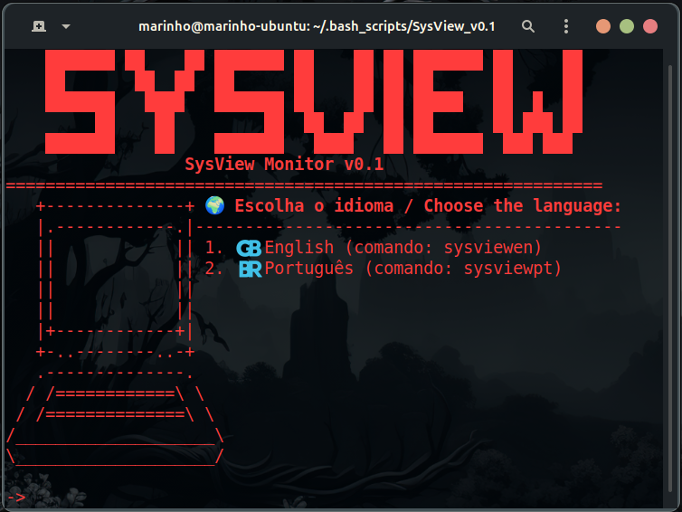
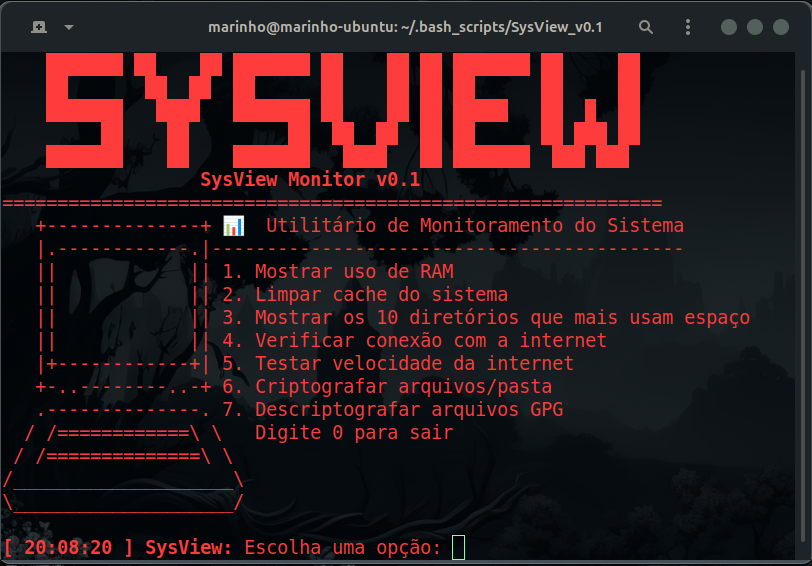
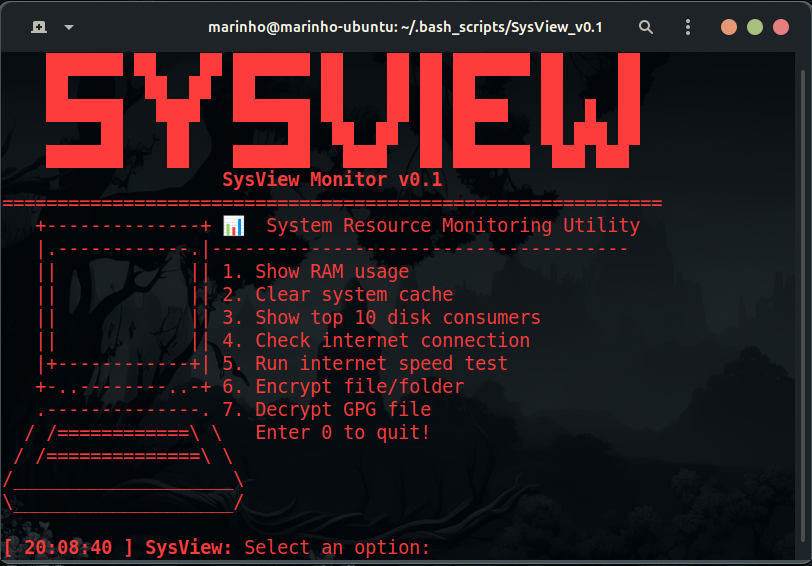

<h1>📦 SysView - Instalação / Installation</h1>

  <h3 align="center">🌍 Escolha o idioma / Choose your language</h3>
  

<h3>🇧🇷 Instalação via Git  |  🇺🇸 Installation via Git</h3>

Clone o repositório e execute o instalador  |  Clone the repository and run the installer:

<pre>
<code>
git clone https://github.com/mar1nho/SysView.git
cd SysView
bash install.sh
</code>
</pre>

Após a instalação, use o comando desejado  |  After installation, run your preferred version:

<pre>
<code>
sysviewpt  # Versão em português
sysviewen  # English Version
</code>
</pre>

  
  

